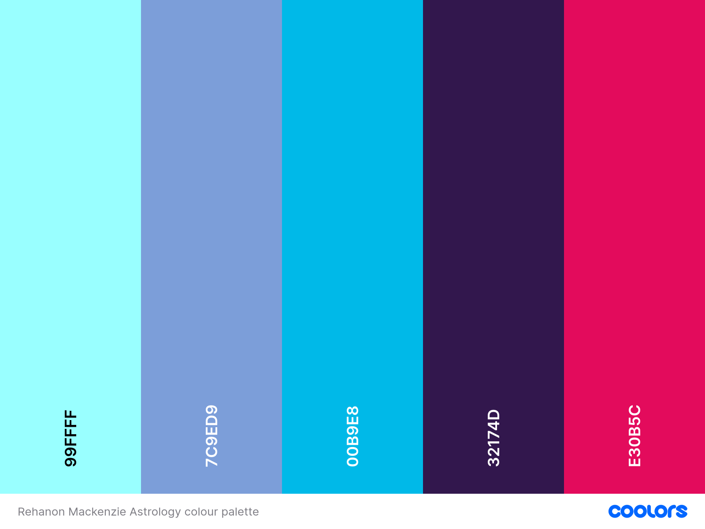
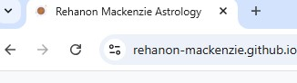

# **Rehanon Mackenzie Astrology**
## **Site Overview**

Rehanon Mackenzie Astrology is a birth chart reading service that focuses on offering espoke astrological readings for clients with a focus on providing clear and praticable advice that they can follow to make changes in their lives.  Rehanon has trained as an evolutionary astrologer and has a particular interest in helping clients who are at a career crossroads.  

![Am I Responsive Screenshot]

​
## Table of contents:
1. [**Site Overview**](#site-overview)
1. [**Planning stage**]
    * [***Target Audiences***]
    * [***User Stories***]
    * [***Site Aims***]
    * [***Wireframes***](#wireframes)
    * [***Color Scheme***](#color-scheme)
    * [***Typography***]
1. [**Current Features Common to all pages**]
    * [***Header Element***]
    * [***Other Features***]
1. [**Individual Page Content features**]
    * [**About Section Content**]
    * [**Offering Section Content**]
    * [**Testimonial Section Content**]
    * [**Contact Secton Content**]
    * [**Thankyou Page Content**]
1.    [**Future-Enhancements**]
      [**Testing Phase**]
1. [**Deployment**]
1. [**Tech**]
1. [**Credits**]
    * [**General reference**]
    * [**Content**]
    * [**Media**]
    * [**Honorable mentions**]
​
## **Planning Stage**

 

#### **Target Audiences:**
* 

​
#### **User Stories:**
* 

​
#### **Site Aims:**
* 

​​
#### **Wireframes:**

Wireframes for all verions of the website were created on Balsamiq. This gave a clear focus for the layout of the various elements in each section.
* Latop version
[About Section Wireframe](docs/images/laptop-about-wireframe.png)
[Offering and Testimonial Section Wireframe](docs/images/laptop-offering-testimonial-wireframe.png)
[Contact Section Wireframe](docs/images/laptop-contact-wireframe.png)
* Tablet version
[About Section Wireframe](docs/images/tablet-about-wireframe.png)
[Offering and Testimonial Section Wireframe](docs/images/tablet-offering-testimonial-wireframe.png)
[Contact Section Wireframe](docs/images/tablet-contact-wireframe.png)

* Mobile version
[About Section Wireframe](docs/images/mobile-about-wireframe.png)

 ​

#### **Color Scheme:**
​
I used online palette generator Coolors to generate the following:

 

​
#### **Typography**
​
* Throughout the page, the following fonts are used:

​ 

## **Current Features Common to all Pages**

#### **Favicon**

* The favicon is a small image that displays in the browser tab. 
* The intention is to enhance the user experience for those who have multiple tabs open and cannot read the text in the tabs.
* The favicon is a doodle of the planet Mercury.  This was chosen because Mercury is a planet people have head of inconjunction with astrology and is the ruler of my Gemini sun so in keeping with the flow of information provided about me on the website.
* It was taken from the Icons8 website and is credited in the Media Section below

​
#### **Navigation Bar:**
​

![Screenshot of header]

![Screenshot of responsive header]

​

## **Features**
​
#### **Hero Section** 

![Screenshot of hero section]

  

#### **About Section** 

![Screenshot of About Section]

 

#### **Offering Section**

![Screenshot of offering section]

 

#### **Testimonial Section**

[Screenshot of testimonial section]

 

#### **Contact Section**

[Screenshot of contact section]

 

#### **Thank you Page Content**

## **Future-Enhancements**
​

## **Testing Phase**
​
**Responsiveness**

* **Home Page**

​

**Functionality**

​
**Validators**

​
​
## **Bugs**
​

## **Unfixed Bugs**

## **Deployment**

​
## **Tech**
​
## **Software**

 

## **Credits**
​
### **Content:**

### **Media:**

### **Honorable mentions**

