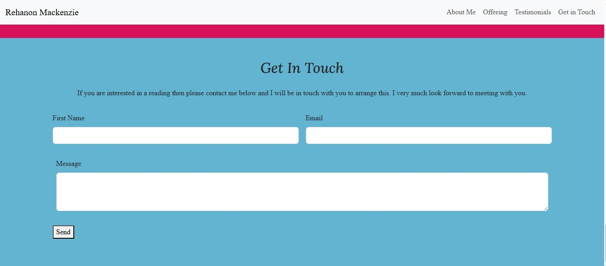
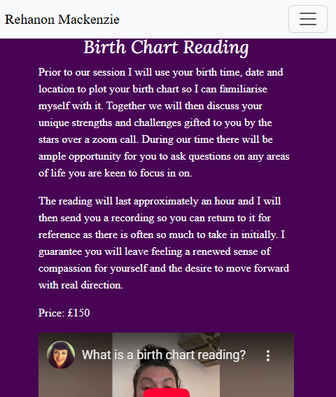

# **Rehanon Mackenzie Astrology**
## **Site Overview**

Rehanon Mackenzie Astrology is a birth chart reading service that focuses on offering espoke astrological readings for clients with a focus on providing clear and praticable advice that they can follow to make changes in their lives.  Rehanon has trained as an evolutionary astrologer and has a particular interest in helping clients who are at a career crossroads.  
​
## Table of contents:
1. [**Site Overview**](#site-overview)
1. [**Planning stage**]
    * [***Target Audiences***](#target-audiences)
    * [***User Stories***](#user-stories)
    * [***Site Aims***](#site-aims)
    * [***Wireframes***](#wireframes)
    * [***Color Scheme***](#color-scheme)
    * [***Typography***](#typography)
1. [**Current Features Common to all pages**]
    * [***Header Element***](#navigation-bar)
1. [**Individual Page Content features**]
    * [**About Section Content**](#about-section)
    * [**Offering Section Content**](#offering-section)
    * [**Testimonial Section Content**](#testimonial-section)
    * [**Contact Secton Content**](#contact-section)
    * [**Thankyou Page Content**](#thank-you-page-content)
1.    [**Future-Enhancements**](#future-enhancements)
      [**Testing Phase**](#testing-phase)
1. [**Deployment**]
1. [**Tech**]
1. [**Credits**]
    * [**General reference**]
    * [**Content**]
    * [**Media**]
    * [**Honorable mentions**]
​
## **Planning Stage**

 

#### **Target Audiences:**
* People who are interested in astrology.
* Adults who are looking to have a birth chart reading and learn about their personal astrology.
* Specifically people who are in a transition in either one multiple areas of their life and is keen for alternative guidance.
* Also people who are interested in self-development and are open to using a wide range of techniques including astrology.

​
#### **User Stories:**
* As a user, I want to know about me and what qualifies me to read a birth chart and give advice.
* As a user, I want to understand what the reading will involve.
* As a user, I want to know how the reading will take place.
* As a user, I want to know how much a reading costs.
* As a user, I want to read about people's experiences on getting a reading to make my decision to book.
* As a user, I want to be able to reach out and contact me with queries or to make a booking.

​
#### **Site Aims:**
* To enable clients to book birth chart readings with me.
* To give people an understanding of who I am and my experience as an astrologer so they feel confident making a book.
* To enable people who don't know what a birth chart reading is a clear explanation of one.
* To let perspective clients know how much the service costs.
* To provide perspective clients honest reviews of the service by previous clients.
* To provide a means of contact so that people can get in touch if  they would like further information.
​​
#### **Wireframes:**

Wireframes for all verions of the website were created on Balsamiq. This gave a clear focus for the layout of the various elements in each section.
#### **Laptop version**
* [About Section Wireframe](docs/images/laptop-about-wireframe.png)
* [Offering and Testimonial Section Wireframe](docs/images/laptop-offering-testimonial-wireframe.png)
* [Contact Section Wireframe](docs/images/laptop-contact-wireframe.png)
#### **Tablet version**
* [About Section Wireframe](docs/images/tablet-about-wireframe.png)
* [Offering and Testimonial Section Wireframe](docs/images/tablet-offering-testimonial-wireframe.png)
* [Contact Section Wireframe](docs/images/tablet-contact-wireframe.png)

#### **Mobile version**
* [About Section Wireframe](docs/images/mobile-about-wireframe.png)

 ​

#### **Color Scheme:**
​
I used online palette generator Coolors to generate the following:

 

​I chose these colours because they are closely associated with spirituality specifically the chakra points.  These include purple for the crown chakra which is associated with higher wisdom.  Blue through the throat chakra and speaking from a place of wisdom. Finally, raspberry pink is associated with passion, excitement and creativity which is always what I hope a birth chart reading will give to people especially when they come for one when they are at a significant cross roasds in their life.

#### **Typography**
​
* Throughout the page, the following fonts are used:
    * Hind Madurai ('https://fonts.googleapis.com/css2?family=Hind+Madurai&display=swap') - I had researched fonts associated with spirituality and astrology and this was one that was suggested and I trialled it and liked it.  
    * Lora ('https://fonts.googleapis.com/css2?family=Lora&display=swap') - One of the other fonts suggested was Lora and again I tried it out and decided it would fit well as a headings font.
    * All fonts have come from Google Fonts and this has been documented in the credits.

​ 

## **Current Features Common to all Pages**

#### **Favicon**

* The favicon is a small image that displays in the browser tab. 
* The intention is to enhance the user experience for those who have multiple tabs open and cannot read the text in the tabs.
* The favicon is a doodle of the planet Mercury.  This was chosen because Mercury is a planet people have head of inconjunction with astrology and is the ruler of my Gemini sun so in keeping with the flow of information provided about me on the website.
* It was taken from the Icons8 website and is credited in the Media Section below

​
#### **Navigation Bar:**
​
* I chose just to have my name on the left hand side as I still need to create a logo for myself and that will be added in future enhancements.  The navigation links are aligned on the right hand side.
* The user is given links to the about, offering, testimonials and contact sections.
* Each navigation link has the hover effect applied to it to provide a visual repsonse for users.
* The header is fully responsive and padding has been added to hero section to ensure that the fixed navigation bar does not block the header in the mobile version.
* In regards to mobiles and other smaller screens the navbar collapses to the hamburger icon to provide an optimal experiences for all users.

## **Features**
​
#### **Hero Section** 

* The main feature of this section is the hero image which I designed on Canva. Again it pulls in the colour purple which is associated with spirituality.
* The stars are the constellation of Taurus which is a simple but effective visaul which again is tying in with astrological theme.
* Furthermore the sign of Taurus is the first earth sign in the zodiac which ties in the message of the h2 that the astrology I practice is grounded and practical.
* The h1 and h2 is an italic because I felt it flowed with the design.
* The short intro paragraph gives a flavour of who I am and why I love astrology and is written to garner interest to carry on navigating the rest of the page.

  

#### **About Section** 

* There is a large profile picture of myself as a rounded object which was chosen because when trying a square object it felt too business like and less warm.
* The content follows on from the intro detailing how I found astrology useful, what I think astrology can offer generally and what guidance I can provide specifically.

 

#### **Offering Section**

* The testimonal section included an embedded video where I describe what a birth chart reading is and what benefits can be gained from it.
* I shot and edited the video myself using CapCut as detailed in the software section.
* The video uses a responsive class to ensure it renders properly in all the screen sizes.
* The video also is set to play in mute as per best practice.
* The text offers a summary of the service I offer and the cost which is something a perspective client will want to know.
 

#### **Testimonial Section**

* The testimonial sections comprises four testimonies from previous clients displayed on cards with the astrological sign of the client above their review which provides colour and interest alongside the text.
* The cards are set to display responsively offering all users a visual pleasing display.
* Media queries were applied to ensure a minimum height on the card text element so all the cards lined up uniformly in each screen size.  This is discussed in the bugs section.

 

#### **Contact Section**

* The form in the contact section displays responsively across all screen sizes.
* The required attribute was added to ensure both the first name and email have to be entered for it to submit.
* A free text space was provided so that clients cannot request a booking but can also send over any questions they may have.
 

#### **Thank you Page Content**

* The thank you page offers users confirmation that their message has been successfully sent and a timeframe in which they can expect to be responded to.
* My name logo at the top right of the screen will return the user to the website.

## **Future-Enhancements**
​
* I will be creating a logo for my astrology service and I will replace the current navbar brand with it.
* A separate page for offerings will be created as I would like to offer transit and solar return readings which would benefit from their own explanatory videos, which would sit better on a separate page.
* A booking calendar and payment system so they can purchase a reading immediately.

## **Testing Phase**
​
**Responsiveness**
* This was tested thoroughly using Chrome Dev tools.  This was incredibly helpful in enabling me to see anomalies that arose in the uniformity of the layout in the various size screens.
* It was especially useful when assessing how the video element in the offering section rendered across all screen sizes.
* I downloaded Live Server and I placed this side by side with my VS Code workspace so I could immediately see the effects of altering the code.
* I sent the link to friends and family so the responsiveness could be tested on Android as well my Apple devices.

* **Hero**
 

* **About**
 
​

* **Offering**
 

* **Testimonial**
 

* **Contact**
 

* **Thank You**
 

 

**Functionality**
* All the links were clicked and tested on various devices to ensure they worked.
* The video element was played on various devices to ensure that it started muted in keeping with best practice.
* The header and navigation bar clear and easy  to use and collapses responsively when required.
* The form inputs and submission work as they should.
* On submitting the form the thank you page automatically loads.
* The link back to the index page on the thank you page works.

​
**Validators**
* HTML Validation using w3c html validator - Each page passed validation
[index page](docs/images/index-html-validator.png)
[thank you page](docs/images/thank-you-html-validator.png)
* CSS Validation using w3c CSS validator - The page passed
[CSS for the website](docs/images/CSS-validator.png)

​
​
## **Bugs**
​

## **Unfixed Bugs**

## **Deployment**

​
## **Tech**
​
## **Software**

 

## **Credits**
​
### **Content:**

### **Media:**

### **Honorable mentions**

